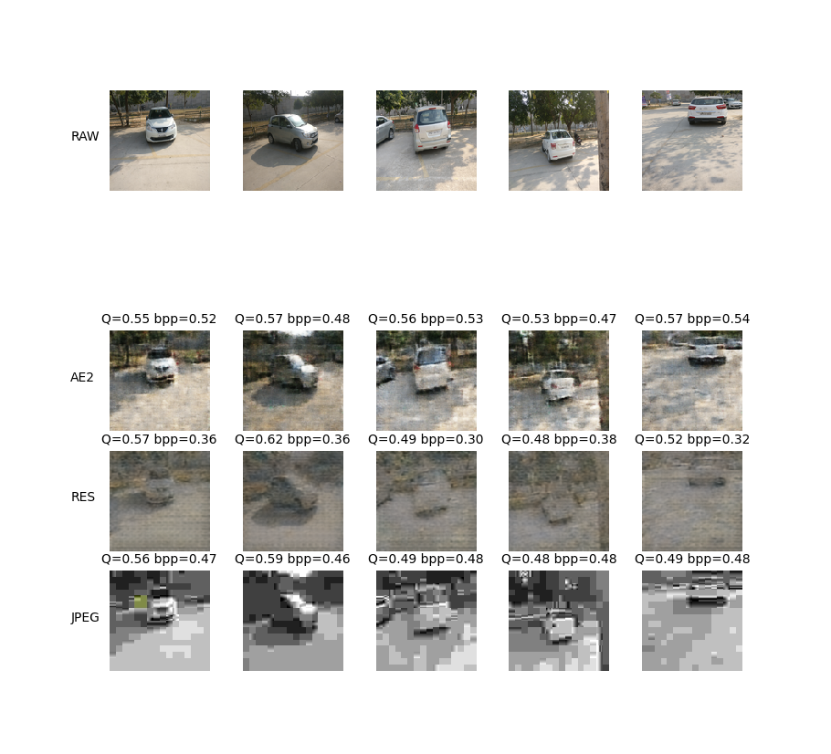
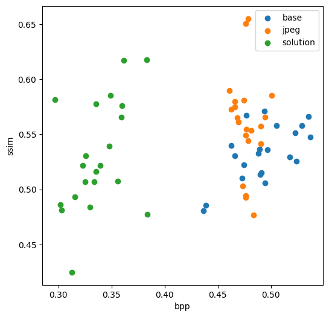
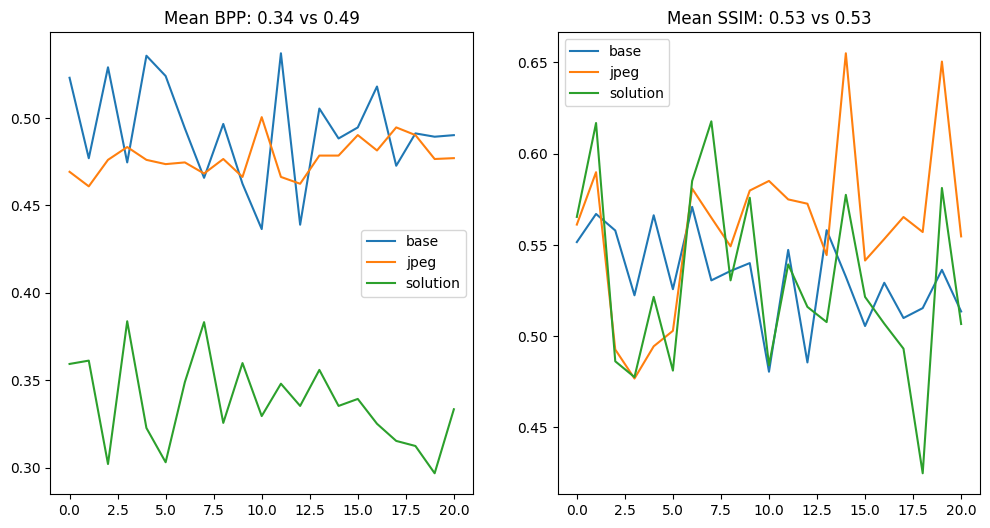

# Сжатие изображения при помощи автокодировщика
## Автор: Черногорский Федор Евгеньевич

## Модель

В качестве модификации моделей энкодера и декодера были удалены слои пулинга, а также были использованы Residual блоки.

## Результаты

**MEAN SSIM: 0.53**

**MEAN BPP: 0.34 vs 0.49**

*Предложенный плюсовый код не компилится на arch без флага '-lsupc++'*